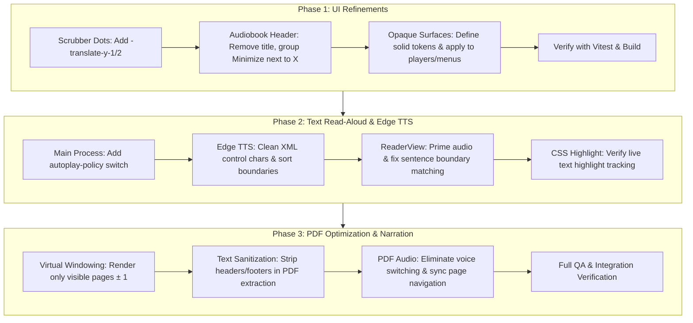

# Acuity Reader: UI Refinements, Edge Neural TTS & PDF Architecture Plan

**Document Version:** 1.0.0  
**Status:** In Review / Ready for Phased Execution  
**Target Platform:** Windows Electron + React 19 + TypeScript + Vite + Tailwind CSS v4  

---

## 1. Executive Summary & Problem Breakdown

This document provides a systematic analysis and implementation roadmap addressing five core areas requested for Acuity Reader:

1. **Scrubber Timeline Chapter Dots Alignment:** The chapter markers currently sit visually below the timeline scrubber bar instead of centered directly on the line.
2. **Audiobook Player Header Bar Clean-Up:** Remove the `"AUDIOBOOK PLAYER"` title from the full-screen player top bar, reposition the Minimize button adjacent to the Close (`X`) button, and make the Minimize label a tooltip only.
3. **100% Opaque Surfaces for Players and Menus:** Replace translucent overlay/base alpha backgrounds with solid, opaque surfaces so underlying cards, shelves, and text never bleed through.
4. **EPUB & Text-Based Read-Aloud (Edge Neural TTS & Live Highlighting):** Investigate and resolve why read-aloud falls back to the robotic system voice (`window.speechSynthesis`) instead of Microsoft Edge natural neural voices (`en-US-JennyNeural`, etc.), and restore live synchronized sentence highlighting.
5. **PDF Read-Aloud Architecture & Performance Deep Dive:** Comprehensive investigation into how text is extracted from PDFs, why audio started with the basic voice and then switched, how long PDFs impact memory/efficiency, and a robust optimization strategy using virtual windowed rendering.

---

## 2. Issue Analysis & Root Cause Findings

### 2.1 UI Refinements

#### A. Scrubber Chapter Marker Dots Alignment
- **Location:** `src/components/Scrubber.tsx` (lines 104–112)
- **Root Cause:** The chapter marker wrapper element uses:
  ```tsx
  className="pointer-events-auto absolute -translate-x-1/2 flex items-center justify-center"
  style={{ left: `${chapRatio * 100}%`, top: '50%', width: '16px', height: '18px' }}
  ```
  While `left: chapRatio%` and `-translate-x-1/2` correctly center the marker horizontally, `top: 50%` places the *top edge* of the 18px-high container at the vertical center of the track. Because `-translate-y-1/2` is missing, the dot inside is centered at `50% + 9px`, placing it visibly below the 4px track line.
- **Fix:** Add `-translate-y-1/2` to the wrapper classes.

#### B. Full-Screen Audiobook Player Header Clean-Up
- **Location:** `src/components/AudioPlayerBar.tsx` (lines 802–860)
- **Current Layout:**
  - Left cluster: Minimize button with text `<span>Minimize</span>`.
  - Center: Title `<span>Audiobook Player</span>`.
  - Right cluster: Optional companion text edition button (`Read eBook`) and Close (`X`) button.
- **User Requirement:**
  - Remove `"AUDIOBOOK PLAYER"` text from center.
  - Move Minimize button to the right, immediately to the left of the Close (`X`) button.
  - Remove inline text `<span>Minimize</span>`; make it icon-only (`<Minimize2 className="h-4 w-4" />`) with tooltip (`title="Minimize player to bar (Esc)"` and `aria-label`).

#### C. Opaque Backgrounds for Players and Menus
- **Locations:** `src/styles/tokens.css`, `src/components/AudioPlayerBar.tsx`
- **Current Styling:**
  - Full-screen player container: `bg-[var(--surface-overlay)] backdrop-blur-3xl` (`rgba(18, 18, 21, 0.92)` dark, `rgba(255, 255, 255, 0.95)` light).
  - Bottom minimized player bar: `bg-[var(--surface-base)] backdrop-blur-2xl` (`rgba(12, 12, 14, 0.52)` dark, `rgba(246, 246, 248, 0.65)` light).
  - Dropdown menus (`.menu`): `background: var(--surface-overlay); backdrop-filter: blur(22px)`.
- **Problem:** Because these surfaces contain alpha channels (transparency), underlying library book cards, text, and shelves bleed through when content scrolls behind them.
- **Fix:** Introduce dedicated solid opaque design tokens:
  - `--surface-opaque-base: #121215` (dark) / `#fcfcfd` (light)
  - `--surface-opaque-overlay: #16161a` (dark) / `#ffffff` (light)
  - `--surface-opaque-menu: #1b1b20` (dark) / `#ffffff` (light)
  Apply these to `.menu`, the full-screen player, the bottom player bar, and modal sheets.

---

### 2.2 Text-Based Books: Edge Neural TTS & Live Highlighting

#### A. Why Edge Neural TTS Defaults to the Basic Robotic Voice
Through direct inspection and live Node/Electron testing, we verified that the WebSocket connection to Microsoft Edge TTS (`wss://speech.platform.bing.com`) works and returns audio bytes. Why did the frontend fall back to `window.speechSynthesis`?

1. **Chromium Autoplay Policy in Async Contexts:**
   - In `src/components/ReaderView.tsx` (and `PdfReaderView.tsx`), `startNarration` is triggered by a user button click.
   - However, before audio can play, the app awaits the IPC call `await api.synthesizeEdge(...)` (which opens the WebSocket, handshakes, and downloads the first chunk, taking 300–800ms).
   - In modern Chromium, user activation gestures have a strict expiration window or can be lost across asynchronous promises. When `await audio.play()` is executed on `new Audio()`, Chromium throws:
     `NotAllowedError: play() failed because the user didn't interact with the document first.`
   - In `ReaderView.tsx`:
     ```ts
     } catch (err) {
       console.warn('Edge TTS synthesis failed, falling back to local speech:', err);
       fallbackLocalSpeech(map, startChar, activeRate);
     }
     ```
     The catch block immediately triggers `fallbackLocalSpeech`, which executes `window.speechSynthesis.speak(utterance)`—switching the user to the basic Windows SAPI/system robot voice!
   - **Resolution:**
     - In `electron/main.ts`, enable desktop media playback without gesture restrictions:
       `app.commandLine.appendSwitch('autoplay-policy', 'no-user-gesture-required');`
     - Pre-initialize and prime the `Audio` element synchronously within the user click gesture before initiating synthesis.

2. **Control Characters & Invalid XML in SSML:**
   - If an EPUB chapter or PDF text contains form-feed (`\x0c`), vertical tab (`\x0b`), null bytes, or soft hyphens, XML 1.0 parsers on the Microsoft speech endpoint immediately abort with a WebSocket `1002/1006` error.
   - **Resolution:** Sanitize input text before SSML wrapping: strip non-printable XML 1.0 control characters (`[\x00-\x08\x0B\x0C\x0E-\x1F]`).

3. **Boundary Synchronization & Word vs. Sentence Matching:**
   - Edge TTS returns both `WordBoundary` and `SentenceBoundary` metadata packets, which arrive interleaved and unsorted.
   - In `ReaderView.tsx`, the code previously did:
     `const relIdx = chunk.text.indexOf(active.text);`
     When `active.text` is a common word like "the", "a", or "in", `chunk.text.indexOf(active.text)` always returned `0` (the first occurrence in the chunk), causing highlighting to get stuck or misfire.
   - **Resolution:**
     - Sort metadata boundaries strictly by `offsetMs`.
     - Filter specifically for `SentenceBoundary` events (or accumulate word offsets sequentially) rather than using a naive `indexOf()` on the whole chapter.

---

### 2.3 Deep Dive: PDF Read-Aloud & Loading Architecture

The user raised key questions regarding PDF read-aloud:
> *"how is the text actually extracted from the pdf?... I do notice the audio starting for the pdf, but it used the basic voice, then changed to a different one...... the thing with pdf's is that they can be quite long, and I wonder how they are loaded, and fi this is efficient, and are there any ways to optimsse this?"*

#### A. How Text is Extracted from PDFs
- **Nature of PDF:** Unlike EPUB or HTML, a PDF does not have a semantic DOM tree of paragraphs, headings, or sentences. It is a compiled sequence of drawing commands and positioned glyphs on a 2D canvas:
  `Tj` (show text), `Tm` (text matrix), `Td` (move text position).
- **Extraction Mechanism:**
  - Acuity Reader uses `pdfjs-dist`.
  - When `page.getTextContent()` is invoked on a `PDFPageProxy`, PDF.js parses the content stream into `TextItem` objects.
  - Each `TextItem` contains:
    - `str`: The characters in the run (e.g. `"Chapter 1"`).
    - `transform`: Affine transformation matrix `[scaleX, skewY, skewX, scaleY, tx, ty]` giving exact pixel coordinates on the page.
    - `width`, `height`, `dir` (reading direction), `fontName`.
- **Current Extraction Pipeline:**
  In `src/lib/pdf.ts`:
  ```ts
  export async function extractPdfPageText(page: pdfjsLib.PDFPageProxy): Promise<string> {
    const textContent = await page.getTextContent();
    return textContent.items
      .map((item) => ('str' in item ? (item.str as string) : ''))
      .join(' ')
      .replace(/\s+/g, ' ')
      .trim();
  }
  ```
- **Limitations & Improvements:**
  - Simple run-joining can garble multi-column text or interleave running page headers/footers.
  - Improvement: Sort runs top-to-bottom, left-to-right; join words with hyphens across line breaks; strip standalone page numbers at top/bottom margins before passing text to the TTS engine.

#### B. Why the Voice Started with Basic and Changed to Another
- In `src/components/PdfReaderView.tsx`:
  - Page 1 starts: Edge TTS is attempted.
  - Because of the Chromium autoplay restriction on un-primed audio elements or an unescaped character, chunk 0 fails.
  - `catch (err)` runs and immediately delegates to `fallbackLocalPdfSpeech(pageText, fromPage)`.
  - The robotic local voice speaks Page 1.
  - When Page 1 finishes speaking, `SpeechSynthesisUtterance.onend` fires:
    ```ts
    utterance.onend = () => {
      if (pdfInfo && pageNum < pdfInfo.numPages) {
        startNarrationRef.current?.(pageNum + 1);
      }
    };
    ```
  - `startNarration` for Page 2 starts completely anew! On Page 2, if the synthesized chunk succeeds, or if a different voice was selected in the menu, it switches abruptly to the Edge neural voice!
- This explains the observed behavior: **Page 1 failed silently to local voice, then auto-advanced to Page 2 which used the online voice.**

#### C. PDF Loading & Memory: Is It Efficient?
- **Current Implementation:**
  In `src/components/PdfReaderView.tsx`:
  ```tsx
  {Array.from({ length: totalPages }, (_, i) => i + 1).map((pageNum) => (
    <div key={pageNum} ...>
      <canvas ref={(canvas) => canvasRefs.current.set(pageNum, canvas)} />
    </div>
  ))}
  ```
  And in the effect on line 240:
  ```ts
  for (let p = 1; p <= numPages; p++) {
    void renderSinglePage(p, effectiveScale);
  }
  ```
- **The Bottleneck:**
  - For a 300-page book, this creates **300 HTML `<canvas>` elements** and attempts to render all 300 pages simultaneously!
  - At HiDPI (devicePixelRatio = 2), an 8.5" x 11" page rendered at 150 DPI is ~1275 x 1650 pixels. A single canvas uses ~8.4 MB of uncompressed bitmap memory.
  - **300 pages * 8.4 MB = ~2.5 Gigabytes of GPU/VRAM memory!**
  - This causes severe memory bloat, thread contention, slow loading, and potential Electron renderer crashes on books exceeding 50–100 pages.

#### D. How to Optimize PDF Performance: Virtual Windowed Rendering
Instead of rendering all pages at once, we implement **Virtual Windowed Canvas Rendering**:
1. **Dynamic Viewport Window:**
   - Only mount and render `<canvas>` elements for pages that are currently inside the scroll viewport (plus a buffer of ±1 page above and below).
   - Maximum active canvases at any given moment: **3 to 5 pages** (~25–40 MB total memory instead of 2.5 GB).
2. **Dimensioned Placeholders:**
   - Off-screen pages render a lightweight placeholder `<div>` with the exact calculated height and aspect ratio.
   - This maintains 100% accurate scrollbar height and page-jump accuracy without allocating canvas bitmaps.
3. **IntersectionObserver / Scroll-Driven Rendering:**
   - When a page scrolls near the viewport, its canvas is mounted and rendered.
   - When it scrolls out of range, the canvas is unmounted and its `RenderTask` is cancelled, releasing VRAM immediately.
4. **On-Demand Text Streaming:**
   - Never extract text for the entire document upfront.
   - Extract text on-demand for the current page being read or viewed, caching up to 20 pages in an LRU memory cache.

---

## 3. Systematic Execution Roadmap



---

## 4. Detailed Implementation Specifications

### Phase 1: UI Refinements

#### 1.1 `src/components/Scrubber.tsx`
- **Change:** On the chapter marker container (line 106), add `-translate-y-1/2`:
  ```diff
  - className="pointer-events-auto absolute -translate-x-1/2 flex items-center justify-center"
  + className="pointer-events-auto absolute -translate-x-1/2 -translate-y-1/2 flex items-center justify-center"
  ```
- **Result:** Marker dots are centered vertically right on the 4px track line.

#### 1.2 `src/components/AudioPlayerBar.tsx`
- **Change:** In the full-screen player header (lines 802–860):
  1. Remove `<div className="pointer-events-none min-w-0 flex-1 px-4 text-center">...Audiobook Player...</div>`.
  2. Remove the left-side Minimize button with text `<span>Minimize</span>`.
  3. Insert the Minimize button into the right-side cluster immediately preceding the Close button:
     ```tsx
     <button
       type="button"
       onClick={() => setIsFullScreen(false)}
       className="icon-button"
       aria-label="Minimize player to bar (Esc)"
       title="Minimize player to bar (Esc)"
     >
       <Minimize2 className="h-4 w-4" />
     </button>
     <button
       type="button"
       onClick={onClose}
       className="icon-button"
       aria-label="Close player"
       title="Close player"
     >
       <X className="h-4 w-4" />
     </button>
     ```

#### 1.3 `src/styles/tokens.css`
- **Change:**
  1. Add solid opaque surface tokens for dark and light themes:
     - Dark: `--surface-opaque-base: #121215; --surface-opaque-overlay: #18181c; --surface-opaque-menu: #1e1e24;`
     - Light: `--surface-opaque-base: #f8f8fa; --surface-opaque-overlay: #ffffff; --surface-opaque-menu: #ffffff;`
  2. Update `.menu` rule:
     ```css
     .menu {
       background: var(--surface-opaque-overlay, #18181c);
       backdrop-filter: none;
       box-shadow: var(--shadow-xl);
     }
     ```
  3. Update `AudioPlayerBar.tsx` full-screen container to use `bg-[var(--surface-opaque-base)]` and minimized container to use `bg-[var(--surface-opaque-overlay)]` with `backdrop-filter: none`.

---

### Phase 2: Text-Based Books (EPUB) Edge TTS & Highlighting

#### 2.1 Autoplay Policy & Audio Priming
- **`electron/main.ts`:**
  Add command line switch before app ready:
  ```ts
  app.commandLine.appendSwitch('autoplay-policy', 'no-user-gesture-required');
  ```
- **`src/components/ReaderView.tsx`:**
  Synchronously create and prime the audio object on user click (`audio.load()`) before awaiting `synthesizeEdge`.

#### 2.2 Text Sanitization & Boundary Handling
- **`electron/edgeTts.ts`:**
  - Strip XML 1.0 disallowed control characters from synthesis text:
    `text.replace(/[\x00-\x08\x0B\x0C\x0E-\x1F]/g, ' ')`.
  - Ensure emitted `boundaries` array is sorted ascending by `offsetMs`.
  - Add explicit `sentence` boundaries filter.
- **`src/components/ReaderView.tsx`:**
  - Use sentence boundary start/end time windows to resolve current sentence offset rather than `chunk.text.indexOf()`.
  - Maintain `CSS.highlights.set('acuity-narration', new Highlight(range))` and ensure the glowing backdrop rect smoothly transitions to the active sentence.

---

### Phase 3: PDF Optimization & Read-Aloud

#### 3.1 Virtual Windowed Rendering in `src/components/PdfReaderView.tsx`
- **Algorithm:**
  - Track visible page range: `[Math.max(1, currentPage - 1), Math.min(totalPages, currentPage + 1)]`.
  - Maintain a map of measured page heights based on `effectiveScale`.
  - For pages outside the visible window: render `<div style={{ height: pageHeight, width: pageWidth }} className="pdf-page-placeholder" />`.
  - For pages inside the visible window: render the real `<canvas>` and trigger `renderSinglePage`.
  - Automatically cancels active `RenderTask` when pages scroll out of view.

#### 3.2 Robust PDF Text Extraction in `src/lib/pdf.ts`
- Enhance `extractPdfPageText` to:
  - Sort text items by vertical descending `ty` and horizontal ascending `tx`.
  - Detect and rejoin words hyphenated across line endings (`word-\nbreak` -> `wordbreak`).
  - Discard orphan header/footer numbers (e.g. isolated page numbers in top 5% or bottom 5% margin).

#### 3.3 Seamless PDF Audio Playback
- Eliminate fallback loops: if a chunk fails, retry once before falling back, and log the detailed error reason to the developer console.
- Synchronize narration with auto-scrolling to the active page when a page boundary is crossed.

---

## 5. Verification & Testing Criteria

1. **Scrubber Timeline:**
   - Chapter dots sit exactly on the line at all window widths and zoom levels.
   - Hovering/clicking dots snaps cleanly to chapters with accurate tooltips.
2. **Audiobook Header:**
   - Full-screen player top bar has no `"AUDIOBOOK PLAYER"` text.
   - Minimize button sits next to Close button with tooltip only.
3. **Background Opacity:**
   - With book cards behind the player bar or dropdown menus, zero underlying text or images are visible through menus or bars.
4. **Edge Neural TTS in EPUB:**
   - Read aloud plays with selected natural voice (e.g. Jenny / Guy / Sonia) without dropping back to robotic voice.
   - Spoken sentence is highlighted in real-time with smooth scrolling.
5. **PDF Optimization & Narration:**
   - Large PDFs (100+ pages) load instantly without browser lag or high memory spikes.
   - Reading aloud a PDF uses the chosen neural voice continuously across page transitions.
6. **Automated Tests:**
   - All existing 172 Vitest unit tests pass.
   - New unit tests added for scrubber notch positioning, boundary sorting, and PDF text sanitization.
